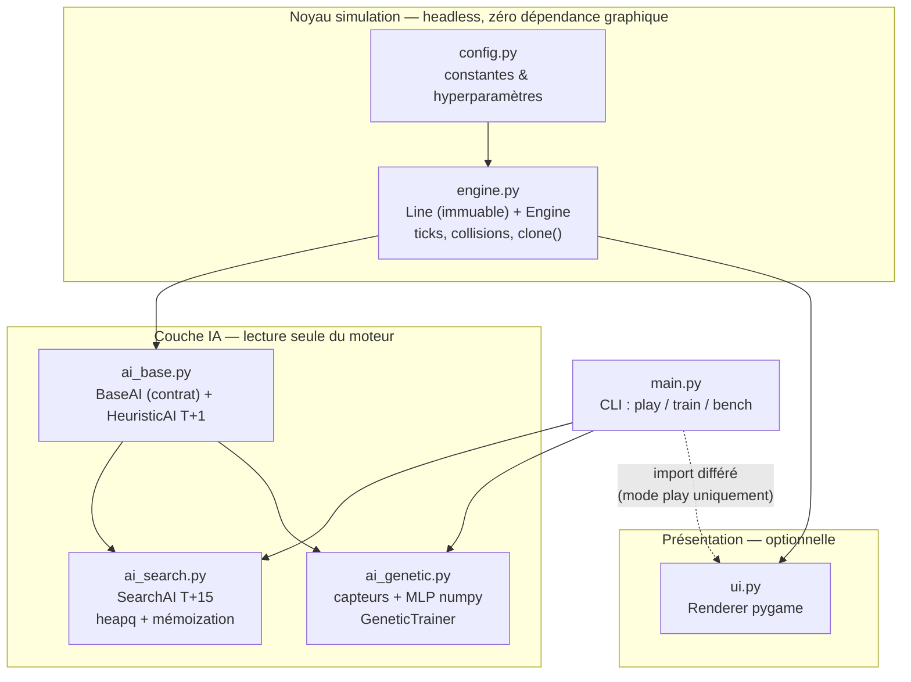
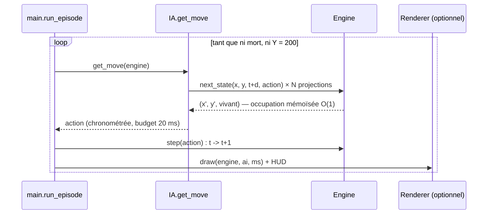
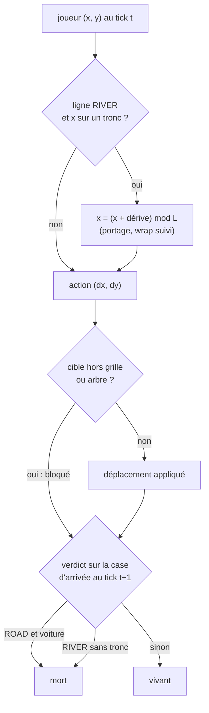
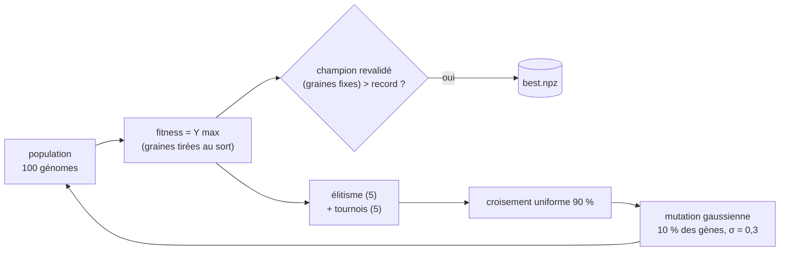

# Audit du code — document d'amélioration

Périmètre : les 8 modules du projet, revue statique + résultats mesurés (bench 20 graines,
entraînements de 40 et 300 générations). Objectif : lister les corrections, optimisations et
évolutions classées par priorité, avec la documentation d'architecture associée.

---

## 1. Schéma architectural (dépendances entre modules)

Propriétés garanties : le noyau ne connaît ni pygame ni les IA ; les IA ne mutent jamais le
moteur (projections via la fonction pure `next_state`) ; l'UI consomme l'état en lecture
seule. `train` et `bench` tournent sans affichage.

## 2. Schéma fonctionnel

### 2.1 Boucle d'évaluation (mode play / bench)

### 2.2 Transition d'un tick (`engine.next_state`)

### 2.3 Boucle de neuroévolution (mode train)

---

## 3. Constats — points solides (à préserver)

- Budget 20 ms tenu avec ~10× de marge au pire cas mesuré (`search` : 0,40 ms moy, 3,2 ms max).
- Prédiction O(1) par formule modulo + mémoization par cycle exact `(y, t mod (période × L))`.
- Mémoization de recherche `(x, y, profondeur)` + borne admissible `f = y + (horizon − d)` :
  optimalité en Y garantie à la première extraction (sortie anticipée type A*).
- Reproductibilité totale par graine ; mêmes mondes pour toutes les IA en bench.
- Découplage strict simulation / affichage vérifié (entraînement headless, UI en pilote factice).

## 4. Améliorations — priorité HAUTE (corrections)

| # | Constat | Localisation | Correction proposée |
|---|---|---|---|
| H1 | ✅ **Corrigé** — Biais spatial des arbres : au-delà du plafond de 6, `sorted(cols)[:6]` concentrait les arbres à gauche. Remplacé par un échantillonnage uniforme `rng.sample`. | `engine._generate_line` | fait |
| H2 | ✅ **Résolu (cause racine ailleurs)** — Les défaites par stagnation de la recherche venaient de mondes localement **insolubles** (rivières empilées de même direction/période à tronc unique : alignement impossible), prouvé par BFS exhaustif sans horizon. Le générateur impose désormais directions opposées + espacement 6 aux rivières consécutives → `search` gagne 25/25. L'horizon de `search` est réglable au lancement (`--horizon`, cf. [ROBOTS.md](ROBOTS.md)). | `engine._generate_line`, `ai_search.SearchAI` | fait |
| H3 | ✅ **Obsolète** — L'espacement fixe « 6 ou 12 » a été remplacé par un **motif de blocs** de longueurs variées (voitures 2 / camions 3 / troncs 2-4) avec des trous quelconques : il n'y a plus d'espacement régulier à tenir au raccord. Seule contrainte : le motif se reproduit en défilant (périodicité). | `Line.blocks`, `Engine._pattern` | fait |
| H4 | **Aucun test dans le dépôt** : la validation a été faite par scripts fumigènes externes non commités ; aucune non-régression rejouable. | racine du projet | ajouter `tests/` pytest : déterminisme par graine, collisions V1/V2, portage avec dérive non nulle, plafond de rivières consécutives, budget temps de `search` |

## 5. Améliorations — priorité MOYENNE (performance & robustesse)

| # | Constat | Localisation | Piste |
|---|---|---|---|
| M1 | `sense()` : 10 balayages `_scan` en Python pur, O(L) chacun. Goulot de l'entraînement (~70 % du temps GA). | `ai_genetic.sense/_scan` | précalculer l'occupation en tableaux numpy booléens par `(ligne, t mod cycle)` et vectoriser les distances (`np.argmax` sur rouleaux) |
| M2 | Évaluation GA strictement séquentielle (100 génomes × 3 épisodes). | `GeneticTrainer.evolve` | `multiprocessing.Pool` par génome (le moteur est picklable) ; ~×nb cœurs, en veillant à la reproductibilité (graines par worker) |
| M3 | `SearchAI` replanifie de zéro à chaque tick alors que le plan précédent reste souvent valide. Déjà ~0,4 ms : gain réel marginal, utile seulement si l'horizon augmente (cf. H2). | `ai_search.get_move` | conserver le chemin élu et ne rechercher que s'il est invalidé |
| M4 | `get_obstacles_at_tick` n'est consommée par aucune IA (les IA passent par `next_state`) : API de spécification vivante mais code mort en pratique. | `engine.get_obstacles_at_tick` | l'utiliser dans l'UI (affichage des dangers projetés) ou la marquer explicitement « API externe » dans la docstring |
| M5 | Typage : `BaseAI.stats: dict[str, float]` reçoit des `int` ; `_text(color: tuple)` non paramétré ; pas de vérification mypy/ruff dans le projet. | `ai_base`, `ui` | `dict[str, int \| float]`, `tuple[int, int, int]`, ajouter `ruff` + `mypy` en dépendances dev uv |

## 6. Améliorations — priorité BASSE (axes d'expérimentation IA)

- **B1 — Fitness shaping** : Y max seul est un signal pauvre en début d'évolution (plateau
  observé : 6,6 à 40 générations, 10,2 à 300). Ajouter un bonus faible de survie
  (`+ 0,01 × ticks`) et/ou un malus d'immobilisme accélérerait la découverte des rivières.
- **B2 — Politique stochastique** : argmax pur → boucles comportementales ; un softmax à
  température décroissante diversifierait l'exploration.
- **B3 — Curriculum** : entraîner d'abord sur mondes sans rivière (Phase 1), puis mixtes —
  la génération par graine le permet sans nouveau code moteur.
- **B4 — Capteurs** : ajouter la phase du prochain trou/tronc (délai avant alignement) plutôt
  que la seule distance instantanée ; c'est l'information que `search` exploite et que le
  réseau ne voit pas.
- **B5 — Départage heuristique** : à distance du centre égale, GAUCHE gagne toujours sur
  DROITE (`<` strict) — biais systématique, sans impact mesuré, départage aléatoire seedé
  possible.
- **B6 — CLI** : exposer `--fps` et `--horizon` pour l'exploration interactive.

## 7. Plan d'action proposé

1. **Lot correctif** (H1, H3-documentation, H4) : sans risque, immédiat.
2. **Lot recherche** (H2 + M3) : traite les dernières défaites de `search` ; mesurable au bench.
3. **Lot entraînement** (M1, M2, B1) : accélère le GA d'un ordre de grandeur et débloque le
   plateau de fitness ; re-benchmarker `nn` ensuite.
4. **Lot outillage** (M5) : ruff + mypy en pré-commit.

Chaque lot doit se conclure par `uv run python main.py --mode bench --episodes 25` et la
comparaison au tableau de référence du README.
